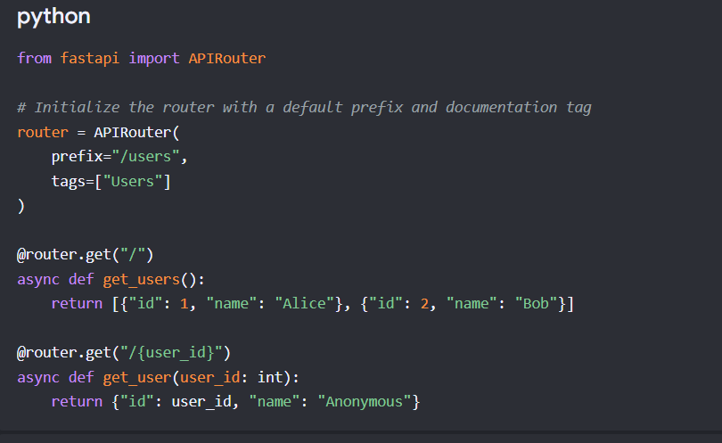
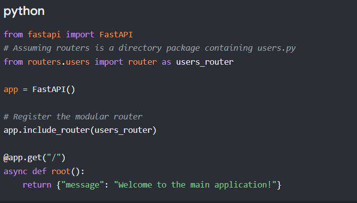

## FastApi Notes

- What is the difference between ASGI and WSGI

| Feature                | WSGI (Web Server Gateway Interface)                                       | ASGI (Asynchronous Server Gateway Interface)                               |
| ---------------------- | ------------------------------------------------------------------------- | -------------------------------------------------------------------------- |
| Purpose                | Standard interface between web server and synchronous Python applications | Standard interface between web server and asynchronous Python applications |
| Supports               | Synchronous (Blocking) code                                               | Synchronous and Asynchronous code                                          |
| Execution Model        | One request is processed at a time per worker                             | Multiple requests can be processed concurrently without blocking           |
| Concurrency            | Achieved using multiple threads or processes                              | Achieved using Python's `async` and `await` (event loop)                   |
| Async Support          | ❌ No native support                                                       | ✅ Native support                                                           |
| Performance            | Good for CPU-bound or simple applications                                 | Better for I/O-bound applications with many concurrent requests            |
| WebSockets             | ❌ Not supported                                                           | ✅ Fully supported                                                          |
| Long-lived Connections | Poor support                                                              | Excellent support                                                          |
| Server Examples        | Gunicorn, uWSGI, mod_wsgi                                                 | Uvicorn, Hypercorn, Daphne                                                 |
| Framework Examples     | Flask, Pyramid, older Django                                              | FastAPI, Starlette, Quart, modern Django (ASGI mode)                       |
| Request Handling       | Blocks until request completes                                            | Can pause one request while waiting and serve others                       |
| Best Use Cases         | Traditional CRUD web apps                                                 | APIs, chat apps, streaming, real-time systems, microservices               |

- What is path variable and what is Query Parameters? 
- Path Variable- A Path Parameter (also called a Path Variable) is a value that is part of the URL path.
In short- Identifies which resource you want.

* eg. i want user_id 10 result
     @app.get("/users/{user_id}")   
     def get_user(user_id:int):
        return user_id
    
    Here the {user_id} in url - GET /users/10 

* What is query parameter?
- Query Parameter comes after the question mark (?) in the URL.
  It is not used to identify the resource. Instead, it changes or filters the response.

  eg. 
  @app.get("/users/{user_id}")
  def get_user(user_id: int, details: bool = False):
    return {
        "user_id": user_id,
        "details": details
    }

  Request- GET /users/10?details=true

### Difference between Path Parameter Vs Query Parameter

  | Feature         | Path Parameter                                             | Query Parameter                                           |
| --------------- | ---------------------------------------------------------- | --------------------------------------------------------- |
| Position        | Inside the URL path                                        | After `?` in the URL                                      |
| Purpose         | Identify a specific resource                               | Filter, search, sort, paginate, or customize the response |
| Required        | Usually yes                                                | Usually optional                                          |
| Syntax          | `/users/10`                                                | `/users?page=2`                                           |
| Multiple Values | Multiple path segments are possible (`/users/10/orders/5`) | Multiple parameters separated by `&` (`?page=2&limit=10`) |
| Used For        | IDs, names, unique resources                               | Filters, search, sorting, pagination                      |
| Example         | `/employees/101`                                           | `/employees?department=IT`                                |

### What is Response Model ?
A response_model is a Pydantic model that defines the structure of the response returned by your API.

Think of it as a contract between your API and its consumers.

It tells FastAPI:

"No matter what my function returns internally, only return data that matches this model."

### what is ORM (Object Relational Mapping)?

## What is SQLModel, SQLAlchemy? 

SQL Injection
SQL injection is a code injection technique that can destroy your database. SQL injections are a common web hacking technique.

SQL injections are when attackers insert malicious SQL code into user-input fields, and this way can read, modify, or delete sensitive data in a database.

SQL injections usually occur when you ask a user for input, like username/userid, and instead of giving a name/id, the attacker inserts an SQL command that executes something in your database.

### What is Routing (Router)?

A Router in FastAPI is an object that groups related API endpoints together. Using APIRouter  Class.

Instead of putting every API in one main.py file, you create separate routers for different features.

- e.g 

1. Define the router

2. Connect to the main.py (App)

- What does include_router? 

It Merges Files: It tells your main FastAPI application, "Hey, I wrote a bunch of endpoints in another file. Please copy and paste them into the main app so they work."

- It Keeps Things Neat: It allows you to build a massive website with thousands of pages while keeping your main file completely clean and easy to read.

- What does tags?
 tags: Group endpoints logically under a designated category inside the automated Swagger UI interactive documentation.

* Use prefixes to avoid repeating common URL paths.
* Use tags to organize Swagger/OpenAPI documentation.

* Why use APIRouter?
1. Clean Code: Keeps main.py from growing into a massive, unreadable file.Modularity: Allows separate teams to build and test isolated features inside independent subfolders.
2. Reusability: Global configurations like authentication gates can be applied to an entire router block at once instead of decorating every single endpoint function.

## What is JWT (Json)
1. JSON Web Token (JWT) is a compact, URL-safe string used to implement stateless user authentication and authorization. 
2. Instead of saving session data on the server side, FastAPI issues a signed, cryptographically secure token to the client upon login. The client transmits this token in the header of subsequent requests to safely verify their identity without database lookups.

- The 3 Parts of a JWTEvery JWT string consists of three parts separated by dots (.)

1. :Header: Specifies the token type and the hashing algorithm (e.g., HS256).

2. Payload: Contains the "claims" or user data (e.g., user_id, role, and expiration time exp).

3. Signature: Built by hashing the header, payload, and a secret key known only to your backend to prevent tamperin

* Complet JWT Flow 

User
 |
 | Login
 |
FastAPI
 |
 | Verify credentials
 |
Database
 |
 | User valid
 |
Generate JWT
 |
Return JWT
 |
User stores JWT
 |
Authorization: Bearer <JWT>
 |
FastAPI
 |
Verify Signature
 |
Read Payload
 |
Allow Access

### Fastapi Theory Last Minute Content
@[text](https://chatgpt.com/share/6a70e5b3-a840-83ee-b1e1-b4b17ff8ec1f)